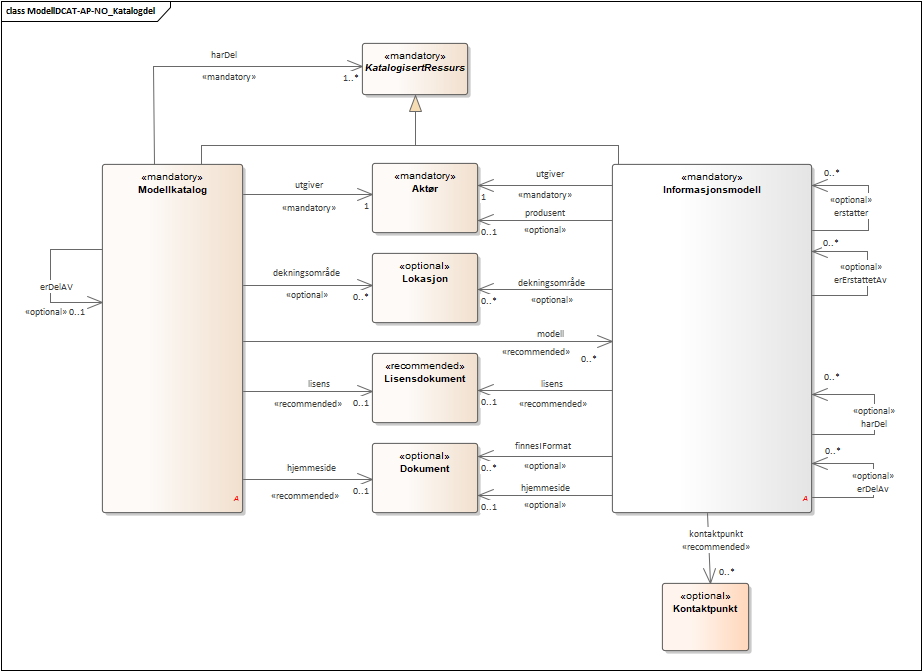

== Kort om ModellDCAT-AP-NO

ModellDCAT-AP-NO er basert på https://data.norge.no/specification/dcat-ap-no/[_Standard for beskrivelse av datasett, datatjenester og datakataloger (DCAT-AP-NO)_] og inngår i https://digdir.no/2118[Rammeverk for informasjonsforvaltning].

Figurene nedenfor viser en forenklet modell av ModellDCAT-AP-NO beskrevet i UML. Egenskapene er utelatt, og kun de mest sentrale klassene og relasjonene er tatt med. Modellene viser kun de norske klasse- og relasjonsnavnene. For fullstendig oversikt, se https://data.norge.no/specification/modelldcat-ap-no/[spesifikasjonen for ModellDCAT-AP-NO].

.Forenklet modell for ModellDCAT-AP-NO - Katalogdel
[link=images/ModellDCAT-AP-NO_Katalogdel.png]

.Forenklet modell for ModellDCAT-AP-NO - Modelldel
[link=images/ModellDCAT-AP-NO_Modelldel.png]
image::images/ModellDCAT-AP-NO_Modelldel.png[]

Spesifikasjonen består av to hoveddeler, en katalogdel som er basert på DCAT-AP-NO 2.0 (lysebrune klasser) og en utvidet del, modelldel (grå klasser), som beskriver en informasjonsmodell og dens innhold. Som datasett og datatjenester, er informasjonsmodell beskrevet som en subklasse til klassen https://data.norge.no/specification/dcat-ap-no/#klasse-katalogisert-ressurs[Katalogisert ressurs] (`dcat:Resource`).

I ModellDCAT-AP-NO er det definert noen overordnede klasser. Disse er:

*   	https://data.norge.no/specification/modelldcat-ap-no/#klasse-katalogisert-ressurs[Katalogisert ressurs] (`dcat:Resource`)

*   	https://data.norge.no/specification/modelldcat-ap-no/#Modellelement-egenskaper[Modellelement] (`modelldcatno:ModelElement`)

*   	https://data.norge.no/specification/modelldcat-ap-no/#klasse-egenskap[Egenskap] (`modelldcatno:Property`)

Disse skal i en konkret bruk erstattes med en av de spesifikke subklassene.

Siden ModellDCAT-AP-NO er basert på DCAT-AP-NO 2.0, er spesifikasjonen beskrevet i RDF. Det betyr at modellen (målmodellen) som du skal transformere til, også må være i RDF.
