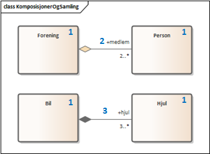
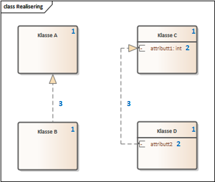
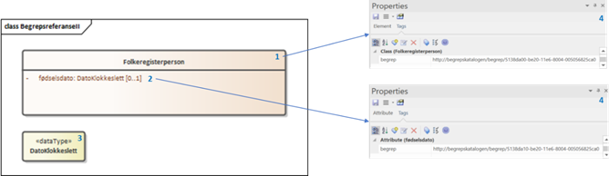

== Modellinnhold [[Modellinnhold]]

=== Basis modellelementer og egenskaper [[basis-modellelementer-og-egenskaper]]

*****
*Objekttype:* beskriver en klasse av objekter med felles egenskaper.

*Datatype:* beskriver en sammensatt verdistruktur uten identitet.

*Attributt:* beskriver en basisegenskap ved en objekttype eller datatype.

*Enkeltype:* beskriver verdidomenet for et attributt.

*Rolle:* relasjon som beskriver en rolle et objekt har overfor et annet.

*Kodeliste:* beskriver et sett av lovlige verdier for et attributt.

*Kodeelement:* representere et navngitt og unikt element i en kodeliste.

*Spesialisering:* beskriver et arveforhold mellom modellelementer, hvor en subtype er en spesialisering av en mer generell type (supertype).

*Modul:* representerer en delmodell eller kategori som modellelementer og egenskaper i en modell kan grupperes under.
*****

Figuren nedenfor viser en enkel informasjonsmodell med de mest grunnleggende modellelementene. Modellelementene og egenskap er nummerert etter type.

.Eksempel - en enkel informasjonsmodell
image::images/enEnkelModell.png[]

Mapping til ModellDCAT-AP-NO:

|===
|*Modellelement-/egenskapstype*|*UML-representasjon*|*ModellDCAT-AP-NO*
|1 |Class |Objekttype (`modelldcatno:ObjectType`)
|2 |DataType |Datatype (`modelldcatno:Datatype`)
|3 |Primitive |Enkeltype (`modelldcatno:SimpleType`)
|4 |Enumeration |Kodeliste (`modelldcatno:CodeList`
|5 |Package |Modul (`modelldcatno:Module`)
|6 |Attribute |Attributt (`modelldcatno:Attribute`)
|7 |Literal |Kodeelement (`modelldcatno:CodeElement`)
|8 |Generalization |Spesialisering (`modelldcatno:Specialization`)
|9 |Role |Rolle (`modelldcatno:Role`)
|===

Se https://github.com/Informasjonsforvaltning/modelldcat-ap-no/blob/develop/examples/exSimpleModel.ttl[eksemplet i RDF Turtle].

===  Relasjoner [[Relasjoner]]

I modelleksemplet ovenfor har vi beskrevet basis relasjonstyper som spesialisering og roller. ModellDCAT-AP-NO muliggjør også beskrivelse av mer spesialiserte relasjonstyper, som abstraksjoner, assosiasjoner, komposisjoner, realiseringer og samlinger.

==== Abstraksjon [[Abstraksjon]]

*****
Abstraksjon er en relasjon som settes mellom modellelementer eller egenskaper for å vise at disse representerer det samme konseptet, men på ulike abstraksjonsnivåer.
*****

.Eksempel - Abstraksjon
image::images/eksempelAbstraksjon.png[]

Eksempelet viser to former for abstraksjoner. De grå boksene i diagrammet kommer fra en standard utarbeidet av den Europeiske kringkastingsunionen (EBU). Editorial object representerer et redaksjonelt sammensatt produkt, et program eller en podcast. Timeline representerer tidsaksen i programmet og brukes til å vise hvordan de ulike Mediaitems, plater og prat, avvikles sekvensielt.

Så er det boksen Program. I diagrammet står den alene, men er nok en del av en større modell. For å vise slektskapet mellom Program og Editorial object så bruker man en abstraksjon, i form av en antydning at man her snakker om det samme, uten at man nødvendigvis har et samsvar i hvordan man har modellert med tanke på egenskaper og lignende.

Så har vi en annen abstraksjon: Program-klassen har en egenskap “description” som er en tekstlig beskrivelse av programinnholdet. Dette er jo samme type opplysning som vil framgå av konstruksjonen med Timeline og Mediaitems. Måten det er modellert på her er jo helt annerledes, og den grå modellen vil være mye mer detaljert, men “description” feltet vil fungere som en beskrivelse av det samme konseptet, dette slektskapet utrykker vi med en abstraksjon.

Mapping til ModellDCAT-AP-NO:

|===
|*Modellelement-/egenskapstype*|*UML-representasjon*|*ModellDCAT-AP-NO*
|1|Class|Objekttype (`modelldcatno:ObjectType`)
|2|Attribute|Attributt (`modelldcatno: Attribute`)
|3|Abstraction|Abstraksjon (`modelldcatno:Abstraction`)
|4|Primitive|Enkeltype (`modelldcatno:SimpleType`)
|5|Role|Rolle (`modelldcatno:Role`)
|6|Aggregation|Samling (`modelldcatno:Collection`)
|===

Se https://github.com/Informasjonsforvaltning/modelldcat-ap-no/blob/develop/examples/exAbstraction.ttl[eksempelet i RDF Turtle].

====  Assosiasjon [[Assosiasjon]]

Assosiasjoner (`modelldcatno:Association`) beskriver enkle relasjoner mellom modellelementer, som er vanlig i mer konseptuelle modeller. Eksempelet nedenfor viser et enkelt utsnitt av begrepsmodellen for Folkeregisteret.

.Eksempel - Assosiasjon
image::images/eksempelAssosiasjon.png[]

Mapping til ModellDCAT-AP-NO:

|===
|*Modellelement-/egenskapstype*|*UML-representasjon*|*ModellDCAT-AP-NO*
|1|Class|Objekttype (`modelldcatno:ObjectType`)
|2|Association|Assosiasjon (`modelldcatno:Association`)
|===

Se https://github.com/Informasjonsforvaltning/modelldcat-ap-no/blob/develop/examples/exAssociation.ttl[eksemplet i RDF Turtle].

==== Samling og komposisjon [[Samling-og-komposisjon]]

*****
*Samling:* relasjon mellom to modellelementinstanser, hvor den ene instansen inngår som en del av en annen, og kan eksistere uavhengig av den andre.

*Komposisjon:* relasjon mellom to modellelementinstanser, hvor den ene instansen inngår som en del av en annen, og kan bare eksistere sammen med den andre.

*****

.Eksempel - Komposisjon og Samling

Mapping til ModellDCAT-AP-NO:
|===
|*Modellelement-/egenskapstype*|*UML-representasjon*|*ModellDCAT-AP-NO*
|1|Class|Objekttype (`modelldcatno:ObjectType`)
|2|Aggregation|Samling (`modelldcatno:Collection`)
|3|Composition|Komposisjon (`modelldcatno:Composition`)
|===

Se https://github.com/Informasjonsforvaltning/modelldcat-ap-no/blob/develop/examples/exCollectionAndComposition.ttl[eksemplet i RDF Turtle].

====  Realisering [[Realisering]]

*****
Realisering er et forhold mellom modellelementer og/eller egenskaper, der det ene modellelementet/egenskapen (klienten, engelsk client) realiserer atferden som det andre modellelementet/egenskapen (leverandøren, engelsk supplier) spesifiserer. Flere klienter kan realisere atferden til en enkelt leverandør.
*****

.Eksempel - Realisering

Eksemplet viser hvordan man i https://www.kartverket.no/geodataarbeid/standardisering/sosi-standarder2/standarder-geografisk-informasjon[SOSI-standardene] for geografisk informasjon har definert SOSI-typer som en realisering av typer i https://www.geonorge.no/Geodataarbeid/inspire/[INSPIRE]. Her er ikke alle egenskapene fra standardene tatt med.

Mapping til ModellDCAT-AP-NO:

|===
|*Modellelement-/egenskapstype*|*UML-representasjon*|*ModellDCAT-AP-NO*
|1|Class|Objekttype (`modelldcatno:ObjectType`)
|2|Attribute|Attributt (`modelldcatno: Attribute`)
|3|Realization|Realisering (`modelldcatno:Realization`)
|4|DataType|Datatype (`modelldcatno:Datatype`)
|5|Primitive|Enkeltype (`modelldcatno:SimpleType`)
|===

Se https://github.com/Informasjonsforvaltning/modelldcat-ap-no/blob/develop/examples/exRealization.ttl[eksemplet i RDF Turtle].

==== Relasjonsegenskap [[Relasjonsegenskap]]

*****
En relasjonsegenskap beskriver et symmetrisk forhold mellom to egenskaper (som f.eks. rolle, komposisjon og samling). Forholdet kan navngis.
*****

I ModellDCAT-AP-NO er det ikke et eget modellelement som beskriver toveisrelasjoner, som f.eks. assosiasjon i UML. I stedet kan man knytte to og to egenskaper sammen, f.eks. roller, og navngi dette forholdet. Ved å spesifisere om egenskapene er navigerbar eller ikke, kan man angi leseretning på dette forholdet.

.Eksempel - Relasjonsegenskap
image::images/eksempelRelasjonsegenskap.png[]

Mapping til ModellDCAT-AP-NO:
|===
|*Modellelement-/egenskapstype*|*UML-representasjon*|*ModellDCAT-AP-NO*
|1|Class|Objekttype (`modelldcatno:ObjectType`)
|2|Role|Rolle (`modelldcatno:Role`)
|3|Composition + Role|Komposisjon (`modelldcatno:Composition`)
|4|Aggregation + Role|Samling (`modelldcatno:Collection`)
|5|Association, Composition, Aggregation|utgjør symmetrisk relasjon med (`modelldcatno:formsSymmetryWith`)
|===

Se https://github.com/Informasjonsforvaltning/modelldcat-ap-no/blob/develop/examples/exRelationProperty.ttl[eksemplet i RDF Turtle].

=== Begrepsreferanse [[Begrepsreferanse]]

*****
En begrepsreferanse er en relasjon fra et modellelement/egenskap til et begrep, hvor begrepet det refereres til beskriver den semantiske betydningen av modellelementet/egenskapen.
*****

For å kunne beskrive den semantiske betydningen til modellelementer, egenskaper og kodeelementer, kan disse knyttes til begreper.

.Eksempel - Begrepsreferanse

Siden det ikke er en egen mekanisme i UML for å referere fra modellelementer til begreper, er det opprettet en tag, _begrep_ som plassholder for begrepsreferanser.  Begrepsreferansene peker her til Skatteetatenes begreper for folkeregisterperson og fødselsdato.

Mapping til ModellDCAT-AP-NO:
|===
|*Modellelement-/egenskapstype*|*UML-representasjon*|*ModellDCAT-AP-NO*
|1|Class|Objekttype (`modelldcatno:ObjectType`)
|2|Attribute|Attributt (`modelldcatno:Attribute`)
|3|Primitive|Enkeltype `(modelldcatno:SimpleType`)
|4|Tagged value|begrep (`dct:subject`)
|===

Se https://github.com/Informasjonsforvaltning/modelldcat-ap-no/blob/develop/examples/exSubject.ttl[eksemplet i RDF Turtle].

===  Begrensningsregel [[Begrensningsregel]]

*****
En beregningsregel beskriver hvilke begrensninger som gjelder for én eller flere egenskaper og/eller modellelementer.
*****

ModellDCAT-AP-NO tillater å beskrive begrensninger på bruk av en eller flere modellelementer og egenskaper ved bruk av klassen Begrensningsregel (`modelldcatno:ConstraintRule`). Beregningsuttrykk kan være en tekstlig beskrivelse, men også mer maskinelle lesbare uttrykk, som f.eks. Object Constraint Language (OCL). I tillegg er det definert to subklasser til Begrensningsregel, Enten eller (`modelldcatno:Xor`) og Eller (`modelldcatno:Or`).

.Eksempel - Begrensningsregel
image::images/eksempelBegrensningsregel.png[]

Mapping til ModellDCAT-AP-NO:
|===
|*Modellelement-/egenskapstype*|*UML-representasjon*|*ModellDCAT-AP-NO*
|1|Class|Objekttype (`modelldcatno:ObjectType`)
|2|Role|Rolle (`modelldcatno:Role`)
|3|Constraint|Begrensningsregel (`modelldcatno:ConstraintRule`)
|4|Xor|Enten eller (`modelldcatno:Xor`)
|5|Or|Eller (`modelldcatno:Or`)
|===

Se https://github.com/Informasjonsforvaltning/modelldcat-ap-no/blob/develop/examples/exConstraintRule.ttl[eksempel i RDF Turtle].

Merk at for klassen Begrensningsregel (`modelldcatno:ConstraintRule`) må minst én av egenskapene tittel (`dct:title`) eller begrensningsregel (`modelldcatno:constraintExpression`) ha en verdi. Dette gjelder imidlertid ikke for subklassene Enten eller (`modelldcatno:Xor`) og Eller (`modelldcatno:Or`), hvor kun egenskapen begrensning (`modelldcatno:constraint`) er påkrevd.

=== Note [[Note]]

*****
En note (merkelapp) brukes til å beskrive en merknad, forklaring eller tilleggsopplysning til ett eller flere modellelementer og/eller egenskaper.
*****

.Eksempel - Note
image::images/eksempelNote.png[]

Mapping til ModellDCAT-AP-NO:
|===
|*Modellelement-/egenskapstype*|*UML-representasjon*|*ModellDCAT-AP-NO*
|1|Class|Objekttype (`modelldcatno:ObjectType`)
|2|Attribute|Attributt (`modelldcatno:Attribute`)
|3|Note|Note (`modelldcatno:Note`)
|4|Primitive|Enkeltype (`modelldcatno:SimpleType`)
|===

Se https://github.com/Informasjonsforvaltning/modelldcat-ap-no/blob/develop/examples/exNote.ttl[eksempel i RDF Turtle].

===  Valg (Choice) [[Valg]]

*****
Valg er en egenskap som tillater at én egenskap eller modellelement av et sett av valgbare egenskaper og/eller modellelementer, kan inngå i det bærende modellelementet.
*****

Nedenfor vises to eksempler på bruk av Valg (Choice), hvor det første tar for seg enkelvalg (single choice) og det andre flervalg (multiple choice). Valg (Choice) er et konsept som finnes bl.a. i XML Schema Definition (XSD). I eksemplene har vi benyttet UML-modeller. Siden Valg ikke er et eget element i UML klassediagram, har vi framstilt det som en klasse med stereotype «Valg». Selve valgene har vi også representert som XSD Choice.

====  Enkelvalg [[Enkelvalg]]

Eksemplet nedenfor viser at Person kan ha null til mange bostedsadresser. Valget _adressevalg_ beskriver at objekttypen Bostedsadresse kan enten ha rollen _vegadresse_ eller _matrikkeladresse_. At dette er et enkelvalg (simple choice), er beskrevet ved at UML assosiasjonen mellom Bostedsadresse og adressevalg har multiplisitet 1.

.Eksempel - Enkelvalg
image::images/eksempelEnkelvalg.png[]

Mapping til ModellDCAT-AP-NO:
|===
|*Modellelement-/egenskapstype*|*UML-representasjon*|*ModellDCAT-AP-NO*
|1|Class|Objekttype (`modelldcatno:ObjectType`)
|2|Role|Rolle (`modelldcatno:Role`)
|3|Class, stereotype «Valg»|Valg (`modelldcatno:Choice`)
|===

Se https://github.com/Informasjonsforvaltning/modelldcat-ap-no/blob/develop/examples/exChoice.ttl[eksempel i RDF Turtle].

==== Flervalg [[Flervalg]]

Flervalg (multiple choice) brukes når et unikt valg kan foretas flere ganger. Kontaktinformasjon er i eksempelet nedenfor knyttet til et Valg, _telefonvalg_, som representer et valg mellom ulike typer telefonnumre - mobiltelefon, arbeidstelefon og hjemmetelefon. Multiplisiteten 0..2 på assosiasjonsenden mellom Kontaktinformasjon__ __og telefonvalg, beskriver at det kan forekomme opp til to unike valg. Det betyr at _Kontaktinformasjon_ kan maksimalt bestå av to telefonnumre, som er av type mobiltelefon, arbeidstelefon og/eller hjemmetelefon.  I XSD-representasjonen er dette angitt ved at xsd-elementet choice er tildelt verdier for minOccurs og maxOccurs.

.Eksempel - Flervalg
image::images/eksempelFlervalg.png[]

Mapping til ModellDCAT-AP-NO:
|===
|*Modellelement-/egenskapstype*|*UML-representasjon*|*ModellDCAT-AP-NO*
|1|Class|Objekttype (`modelldcatno:ObjectType`)
|2|Attribute|Attributt (`modelldcatno:Attribute`)
|3|Class, stereotype «Valg»|Valg (`modelldcatno:Choice`)
|4|Primitive|Enkeltype (`modelldcatno:SimpleType`)
|===

Se https://github.com/Informasjonsforvaltning/modelldcat-ap-no/blob/develop/examples/exChoice.ttl[eksempel i RDF Turtle].

=== Rotobjekttype [[Rotobjekttype]]

*****
En rotobjekttype representerer det overordnede objektet i en gruppe av objekter som er knyttet til hverandre i en hierarkisk struktur.
*****

Eksempelet nedenfor viser bruk av rotobjekttype. Rotobjektet er her representert som en klasse med stereotype «Rotobjekttype».

.Eksmepel - Rotobjekttype
image::images/eksempelRotobjekttype.png[]

Mapping til ModellDCAT-AP-NO:
|===
|*Modellelement-/egenskapstype*|*UML-representasjon*|*ModellDCAT-AP-NO*
|1|Class, stereotype «Rotobjekttype»|Rotobjekttype (`modelldcatno:RootObjectType`)
|2|Class|Objekttype (`modelldcatno:ObjectType`)
|3|Role|Rolle (`modelldcatno:Role`)
|===

Se https://github.com/Informasjonsforvaltning/modelldcat-ap-no/blob/develop/examples/exRootObjectType.ttl[eksempel i RDF Turtle].

=== Mer om enkeltyper [[Mer-om-enkeltyper]]

====  Verdirestriksjon [[Verdirestriksjon]]

I ModellDCAT-AP-N0 kan enkeltyper (modelldcatno:SimpleType) ha verdirestriksjoner. Til dette benyttes et utvalg av XML sine tegn- og tallrestriksjoner.

*   	xsd:fractionDigits
*   	xsd:length
*   	xsd:maxExclusive
*   	xsd:maxInclusive
*   	xsd:maxLength
*   	xsd:minExclusive
*   	xsd:minInclusive
*   	xsd:minLength
*   	xsd:pattern
*     xsd:totalDigits

==== Typedefinisjoner [[Typedefinisjoner]]

I ulike modeller kan det benyttes ulike standard ontologier eller bibliotek for primitive datatyper (enkeltyper), f.eks. typesett definert for XSD eller UML.

Ved bruk av egenskapen typedefinisjon (modelldcatno:typeDefinitionReference), kan man referere til ontologien eller biblioteket hvor datatypene er definert i form av en URI.

.Eksempel - Typedefinisjon
image::images/eksempelTypedefinisjon.png[]

Mapping til ModellDCAT-AP-NO:
|===
|*Modellelement-/egenskapstype*|*UML-representasjon*|*ModellDCAT-AP-NO*
|1|Class|Objekttype (`modelldcatno:ObjectType`)
|2|Attribute|Attributt (`modelldcatno:Attribute`)
|3|Primitive|Enkeltype (`modelldcatno:SimpleType`)
|4|Tagged value|maksimum inklusivt (`xsd:maxInclusive`)
|5|Tagged value|minimum inklusivt (`xsd:minInclusive`)
|6|Tagged value|typedefinisjon (`modelldcatno:typeDefinitionReference`)
|===

Se https://github.com/Informasjonsforvaltning/modelldcat-ap-no/blob/develop/examples/exSimpleType.ttl[eksempel i RDF Turtle].

=== Mer om moduler [[Mer-om-moduler]]

====  Stereotyper [[Stereotyper]]

ModellDCAT-AP-NO har ikke et eget element for stereotyper slik man har i UML. Stereotype kan ses som en type gruppering, og moduler kan derfor brukes hvis man har behov for å representere dette.

.Eksempel - Modul (stereotyper)
image::images/eksempelModul.png[]

Mapping til ModellDCAT-AP-NO:

|===
|*Modellelement-/egenskapstype*|*UML-representasjon*|*ModellDCAT-AP-NO*
|1|Class|Objekttype (`modelldcatno:ObjectType`)
|2|Stereotype|Modul (`modelldcatno:Module`)
|===

====  Bruk av farger i diagrammer [[Farger-i-diagrammer]]

Ofte grupperes modellelementer ved at de får ulike farger i diagrammer. I ModellDCAT-AP-NO kan dette representeres ved å bruke moduler. Eksemplet er hentet fra SSBs https://github.com/statisticsnorway/gsim-raml-schema[logiske datamodell] for statistikkinformasjon, som er basert på UNECE standard https://statswiki.unece.org/display/gsim/Generic+Statistical+Information+Model[Generic Statistical Information Model] (GSIM). Egenskaper på objekttypene vises ikke.

.Eksempel - Modul (farger i diagrammer)
image::images/eksempelFarger.png[]

Mapping til ModellDCAT-AP-NO:
|===
|*Modellelement-/egenskapstype*|*UML-representasjon*|*ModellDCAT-AP-NO*
|1|Class|Objekttype (`modelldcatno:ObjectType`)
|2|Legend element|Modul (`modelldcatno:Module`)
|===

Se https://github.com/Informasjonsforvaltning/modelldcat-ap-no/blob/develop/examples/exModule.ttl[eksempel i RDF Turtle].

===  Mer om kodelister [[Mer-om-kodelister]]

Under <<basis-modellelementer-og-egenskaper, Basis modellelementer og egenskaper>> har vi laget et eksempel på hvordan man kan beskrive en enkel enumerasjon som en kodeliste (`modelldcatno:CodeList`), og hvordan vi med egenskapen  «har verdi fra» (`modelldcatno:hasValueFrom`) kan angi at et attributt (`modelldcatno:Attribute`) relaterer seg til en kodeliste.

Andre typiske brukstilfeller er:

* Kodeliste brukt i en informasjonsmodell, hvor kodeelementer ikke er beskrevet, men med referanse til en ekstern beskrivelse av kodelisten eller kodeverket med tilhørende kodeelementer.
*  Kodeliste brukt i informasjonsmodell, med koder og kodetekst
*  Kodeliste som egen informasjonsmodell
* Kodeliste som et datasett (åpne data)

==== Ekstern kodeliste [[Ekstern-kodeliste]]

.Eksempel - Ekstern kodeliste
image::images/eksempelEksternKodeliste.png[]

I eksemplet nedenfor er SSBs kodeliste «StandardForKommuneinndeling» benyttet for å beskrive verdidomenet til attributtet bostedskommune. I stedet for å legge inn alle kommunene som kodeelementer i modellen, henviser man til SSBs nettsider hvor beskrivelsen av kodelistene og kodeelementene ligger.

Mapping til ModellDCAT-AP-NO:
|===
|*Modellelement-/egenskapstype*|*UML-representasjon*|*ModellDCAT-AP-NO*
|1|Class|Objekttype (`modelldcatno:ObjectType`)
|2|Attribute|Attributt (`modelldcatno:Attribute`)
|3|Class, stereotype «Kodeliste»|Kodeliste (`modelldcatno:CodeList`)
|4|Tagged value|har referanse (`rdfs:seeAlso`)
|===

Se https://github.com/Informasjonsforvaltning/modelldcat-ap-no/blob/develop/examples/exExternalCodeList.ttl[eksempel i RDF Turtle].

==== Kodeliste med koder og kodetekst [[Kodeliste-med-koder-og-tekst]]

Enumerasjoner representerer lister med kodeverdier. I ModellDCAT-AP-NO er det mulig å gi mer utdypende beskrivelser av kodeelementene i en kodeliste, som kodetekst, inklusjons-/eksklusjonsmerknader, frarådet kodetekst, definisjon m.m.

Se https://github.com/Informasjonsforvaltning/modelldcat-ap-no/blob/develop/examples/testCodelist.ttl[eksempel på en kodeliste i RDF Turtle].

==== Kodeliste som informasjonsmodell

I ModellDCAT-AP-NO er det mulig å beskrive en eller flere uavhengige kodelister i en egen informasjonsmodell. Ofte er det slik at man gjenbruker de samme kodelistene i ulike modeller. I stedet for å beskrive den samme kodelisten flere ganger, kan man beskrive den én gang i en egen informasjonsmodell. Dermed kan man referere til kodelisten fra modellene hvor den er benyttet.

Se https://github.com/Informasjonsforvaltning/modelldcat-ap-no/blob/develop/examples/testMod2.ttl[eksempel på en kodeliste som en egen informasjonsmodell, i RDF Turtle].

====  Kodeliste som et datasett

En kodeliste kan ses på som en samling av data, og kan dermed beskrives som et datasett i henhold til DCAT-AP-NO.

For å angi at datasettet er en kodeliste, brukes `dct:type`:
----
<https://examples.com/infomoc/exdataset> a dcat:Dataset ;
   dct:type <http://publications.europa.eu/resource/authority/dataset-type/CODE_LIST> .
----

Hvis kodelisten i tillegg er beskrevet som en informasjonsmodell i ModellDCAT-AP-NO, kan denne ses på som en distribusjon til datasettet. Du knytter da datasettet og informasjonsmodellen sammen ved bruk av `dcat:distribution`:

----
<https://examples.com/infomoc/exdataset> a dcat:Dataset ;
   dcat:distribution [ a dcat:Distribution ; dcat:accessURL <https://github.com/Informasjonsforvaltning/modelldcat-ap-no/examples/testMod1> ] .
----
