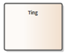
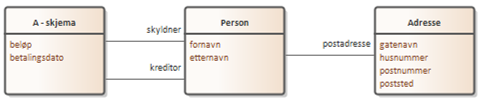

== Informasjonsmodellering enkelt forklart [[infomodellering-enkelt-forklart]]

===  Modellering – et enkelt utgangspunkt

 Vi lager modeller for å strukturere kunnskap. Vi deler opp informasjonen i tenkte enheter: ting. Disse tingene omtales litt forskjellig avhengig av tradisjon og sammenheng, noen sier klasser, noen sier konsepter og i ModellDCAT-AP-NO snakker vi om modellelementer. Uavhengig hva vi omtaler det som er klassen eller modellelementet en måte å samle informasjon om et konsept, noe konkret eller abstrakt.

.Et konsept

Denne informasjonen som beskriver «tingen» kan vi kalle egenskaper.

Alt vi kan utrykke for å beskrive «tingen» er egenskaper, enten det er enkle fakta som en farge, _Enkeltype_, eller en struktur av opplysninger slik som en adresse, _Datatype_, som har flere felter, slik som gatenavn, husnummer, postnummer og poststed. Allerede med disse tre byggesteinene, klasse, enkelttype og datatype, kan man beskrive en datastruktur.

.En datatype
image::images/adresse.png[]

====  Relasjoner

En modell består som regel av mer enn ett konsept. Relasjonen mellom konsepter er i denne sammenhengen også en egenskap.

Hvilken type egenskap er litt avhengig av hva vi fokuserer på i modellen.

I en konseptuell modell der man f.eks. setter begreper i en sammenheng vil en kanskje kalle dette forholdet for en _Assosiasjon_.

[yellow-background]#<sett inn figuren her, "Skyldner" -> "Kreditor">#

Her kan man si at en skyldner kjennetegnes av at man som en av egenskapene har en betalingsforpliktelse til en kreditor.

I modeller som beskriver konkrete forhold, logiske eller fysiske modeller, er det vanlig å beskrive relasjonen mellom to objekter utfra hva det ene objektet betyr for det andre. Rettere sagt, hvilken rolle spiller B for A.

Vi kan tenke oss et skjema (A) der man i tillegg til enkle egenskaper som beløp og datoer ønsker å beskrive en person med navn og adresse. Person er her et selvstendig konsept eller en klasse som blir brukt av skjemaet, i tillegg er det hektet på adresseinformasjon som en egen klasse. +
 Skjemaet som skal beskrives, inneholder informasjon om en som skylder penger, derfor kan man tenke seg at dette beskrives som skjema (A), med to egenskaper som relaterer seg til en person, i det ene tilfelle skyldner, i det andre tilfelle kreditor. Dette er det samme forholdet som var en assosiasjon i den konseptuelle modellen, men som utrykkes som et rolle-forhold i den logiske eller fysiske modellen. +
Ved hjelp av konseptet Modellelement, egenskapene rolle, der ulike Modellelementer brukes for å beskrive ulike deler av informasjonen; og enkeltype og datatype for data om konseptet, kan man utrykke enhver tre-basert datastruktur. +
ModellDCAT-AP-NO har et større mulighetsrom, noe du kan se tidligere i denne veilederen, men som en enkel start er disse fire elementene nok til å beskrive datastrukturer.

==== Metode

Ulike arkitekter vil ha ulike svar på hva de gjør når de modellerer, men her er en metode som virker:

=====  Finn interesseområdet og omfanget av modellen

Det er sagt at alt henger sammen med alt, men skal man lage en modell er det viktig å klargjøre akkurat hva modellen skal gi en oversikt og innsikt i, og hvem som skal bruke modellen.

===== Finn mulige gjenbrukbare modeller

Ikke gjør dobbeltarbeid, hvis du kan bruke ting du eller andre allerede har definert betyr det ikke bare mindre arbeid for deg som arkitekt, det betyr også mindre arbeid for de som skal omsette den konkrete modellen til en applikasjon. Gjenbruk av de samme basiskonseptene letter den gjennomgående forståelsen og sikrer at man beskriver de samme tingene på en ensartet måte.

===== Finn de viktige objektstypene

Også kalt klassene, tingene eller konseptene. Pek ut hva som er viktigst i modellen, og start med disse og bygg ut derifra.

De viktige konseptene kjennetegnes ofte ved at ord som betegner konseptet går igjen i beskrivelsen av systemet. Les igjennom sentrale dokumenter som beskriver feltet og vurder viktigheten av alle substantiver.

I en konseptuell modell vil ofte de objektene som har flest tilknyttede relasjoner være de viktigste. +
La en gruppe mennesker som kjenner område skrive ned på gule lapper hva de forbinder med området som skal beskrives med ett ord. De sentrale objektene er ofte de som beskrives av flest lapper.

===== Finne sammenhengen mellom generelle og spesielle objekttyper

Noen konsepter er slik at det er en utdyping av et annet: loff er en type brød, da kan man si at brød er generelt og at loff er en spesialisering av brød. Med andre ord, vurder om en objekttype er en spesialisering eller en generalisering av en annen objekttype.

=====  Definer egenskapene til objekttypene og beskriv tillatte verdier

Det er her informasjonen kommer inn i modellen. For hver objektstype, finn de egenskapene som beskriver objektet nærmere og legg dem til i form av egenskaper. Identifiser om egenskapen utrykkes på en spesiell måte, er det et heltall, en streng, og har det noen spesifiserte minimum og maksimum verdier. F eks at en gitt egenskap er et heltall mellom 10 og 50.

=====  Beskriv forhold mellom objekttypene

Her beskrives forholdene mellom objektene i modellen. Avhengig av hvilken type modell det er kan man beskrive dette som en assosiasjon, en rolle eller noen av de andre relasjonstypene som er beskrevet senere i dette dokumentet. Forholdet mellom objekttypene i modellen gir struktur.

===== Beskriv verdidomener i form av kodelister

Dersom man vil beskrive en egenskap som noe mer spesifikt enn at egenskapen har et gitt format, men ønsker at feltet skal inneholde en konkret verdi fra en liste, da definerer man en kodeliste. Slike kodelister kan beskrive valgmuligheter som har en lokal gyldighet i en gitt modell, eller være større lister som brukes på tvers av ulike modeller. Dersom listene er store og har et globalt anvendelsesområde, bør de publiseres som egne dokumenter og kun bli referert til fra modellen. Små lokale kodelister kan defineres som en del av modellen.
